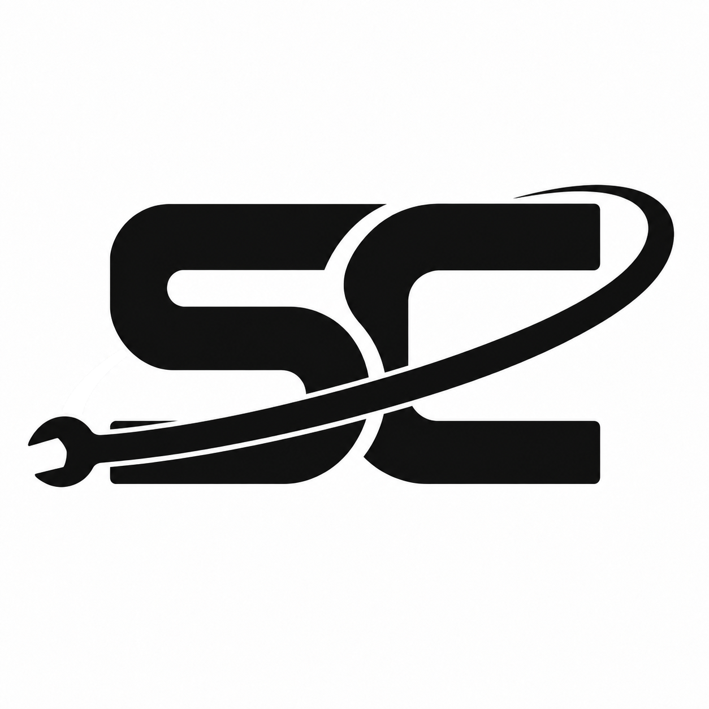

# Frontend Design Brief

## Purpose

This document is the source of truth for the Space Corp interface's visual direction.
It lets visual design progress through deliberate review while the project remains
focused on backend and AI capabilities.

The desired result is a credible operational product: calm, precise, capable, and
memorable. It should suggest an aerospace operations environment without defaulting to
generic science-fiction decoration.

## Design Branch Scope and Handoff

Work on `docs/2.4-identity-options` is limited to documenting design decisions and
preparing reference assets such as logos, icons, mascot concepts, and design studies.
Do not implement frontend changes on this branch: application components, styles,
design tokens, dependencies, and asset integration belong to a separate implementation
task handled by another agent.

For each selected design, record its approval status, asset location, intended use,
and any constraints the implementing agent must preserve. Keep unresolved choices
explicitly pending; retaining a concept does not approve its use in the interface.
The implementation and rendered-review steps below describe the subsequent handoff,
not work authorized on this design branch.

## Approval-Based Design Process

Visual exploration is discussion, not implementation authorization.

1. Present a small set of distinct visual directions without changing application code
   or assets.
2. Review and select, combine, or reject directions with the project owner.
3. Record the approved choices below.
4. Implement only the approved scope in a small, reviewable change.
5. Inspect the rendered interface at desktop and narrow viewport sizes before accepting
   the change.

Changing the logo or wordmark, palette, typography, design tokens, layout language, or
motion requires explicit approval. A later screen may extend the approved system, but
does not silently redefine it.

## Current Direction

Space Corp is a bootstrapped interplanetary maintenance and repair company serving
remote facilities, research stations, and transit infrastructure. Extraordinary
locations have ordinary maintenance needs. The initial interface serves a maintenance
coordinator; broader job roles remain a future product possibility.

The desired character is practical, subtly retro, and professional, with restrained
inspiration from technical manuals and analog aerospace graphics. Keep the working
interface clean and information-rich without clutter. World-building and dry humor
belong mainly in operational descriptions and future scenarios, not in confirmations,
evidence, or error messages. Avoid distressed textures and glowing terminal effects.
The selected logo is the retro SC mark with a wrench in orbit, documented below.
Space Grotesk is selected for interface typography, with Orbitron 900 for the
uppercase company name. Horizontal and stacked lockups are approved. Palette and
interface layout remain undecided. These design approvals do not authorize
frontend implementation on this branch.

The existing operations shell is the starting point, not a final brand decision.
Future proposals should improve cohesion and distinctiveness while preserving the
clarity of the operational data.

### Design Objectives

- Make the question-to-evidence journey feel trustworthy and easy to understand.
- Establish a recognizably Space Corp identity without relying on stock space imagery.
- Give operational states and evidence hierarchy immediate visual clarity.
- Keep the interface usable on common desktop and narrow viewport sizes.
- Use visual polish to support comprehension, never to obscure system limits,
  uncertainty, or errors.

### Constraints

- Accessibility is part of the design: sufficient contrast, visible focus, semantic
  controls, and text or icon support for color-coded status are required.
- Prefer a compact SVG or CSS wordmark/mark over a heavyweight branding dependency.
- Prefer reusable tokens and components over isolated one-off values.
- Use motion sparingly, respect reduced-motion preferences, and never make motion
  necessary to understand a result or state change.
- Do not introduce a UI kit, image library, remote font, analytics, or other dependency
  solely for visual styling without discussion and approval.

## Approved Decisions

The [typography notes](typography-options.md) record the selected fonts and licensing
requirements for the implementation handoff.

The [lockup handoff](lockup-options.md) records both approved arrangements and
links to their reference assets.

The [five color palette options](color-palette-options.md) are all retained for the
next agent to compare on the live page. Keep the SC letters in primary ink and the
wrench/orbit in the accent color across every option. No winning palette is selected.

The selected company logo is **O2**, using the revised version with the rear orbit
segment above the wrench head removed. Preserve the closely fitted SC letters and
remaining orbit exactly as shown in the saved reference.

The [saved logo](design/space-corp-logo.png) is the approved raster reference;
production vector artwork and frontend integration remain future work. Earlier
mockups, font proposals, and palette proposals have been retired and removed.
Monochrome logo approval does not select the interface color palette.

| Area | Approved decision | Rationale | Date |
| --- | --- | --- | --- |
| Product personality | Practical, retro interplanetary maintenance and repair company | Professional operations with character in the world-building | 2026-09-22 |
| Logo | Revised O2 SC mark with wrench orbit | Selected company logo; retain letter shapes and placement | 2026-09-22 |
| Palette | All five retained for live-page comparison; winner pending | Compare in the actual interface | 2026-09-22 |
| Logo color assignment | Primary SC letters; accent wrench/orbit in every palette | Retained two-color treatment | 2026-09-22 |
| Interface typography | Original C: Space Grotesk 400/500/600 | Readable technical interface | 2026-09-22 |
| Company-name typography | Orbitron 900, uppercase | Selected with horizontal C; stronger weight beside the logo | 2026-09-22 |
| Horizontal lockup | C: 80% wordmark size, 5% up, no added horizontal gap; see lockup notes | Approved balance of name and logo | 2026-09-22 |
| Stacked lockup | Tight Orbitron arrangement with no added vertical gap; see lockup notes | Approved compact pairing | 2026-09-22 |
| Layout and spacing | Pending | | |
| Status and feedback | Pending | | |
| Motion | Pending | | |

### Retained Utility Robot

The [utility robot](design/utility-robot.png) is retained as a possible companion for
tooltips or guided walkthroughs, not as the company logo. Its specific role and
implementation remain undecided. The saved image preserves the original concept.

## Review Checklist

### Next Agent: Start Here

1. Read this brief, [typography decisions](typography-options.md),
   [approved lockups](lockup-options.md), and [palette comparison instructions](color-palette-options.md).
   These recorded approvals are the design authority; do not restart selection of
   the approved logo, fonts, or lockups.
2. In a separate implementation branch from `feat/2.4-operational-query-interface`,
   apply the approved identity and make all five retained palettes available for
   owner comparison on the existing page. No palette winner has been approved.
3. Preserve the operational UI content, API behavior, scope review, and evidence
   disclosures. Keep the robot out of the interface until its role is selected.
4. Use the reference assets for visual fidelity. Resolve production exports, font
   delivery and license notices, small-size legibility, and accessible status colors.
   Obtain review for any altered mark, new dependency, or changed design direction.
5. Follow `frontend/AGENTS.md` verification requirements: relevant component tests,
   build, type and formatting checks, plus desktop/narrow and keyboard review.
   Report coverage gaps. This documentation change does not complete waypoint 2.4
   or authorize additional live model evaluations.

Before accepting a visual implementation, confirm that it:

- matches an approved decision above
- supports the primary question, review, answer, evidence, loading, empty, and failure
  states
- remains readable and operable using a keyboard
- communicates status without relying only on color
- has been checked at desktop and narrow viewport sizes
- does not alter API behavior, workspace scope, evidence content, or safety disclosures
